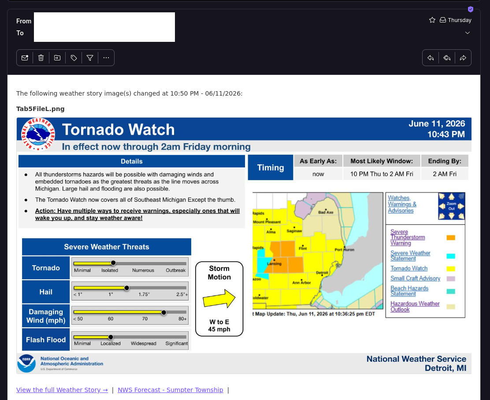

# NWS Weather Story

Watches a [National Weather Service Weather Story](https://www.weather.gov/dtx/weatherstory) graphic for changes and notifies you — by email and/or any [Apprise](https://github.com/caronc/apprise)-supported service (Discord, Telegram, ntfy, Slack, …) — with the updated images attached.

Works with **any NWS office**, not just Detroit: set `WFO` to your local office code.



## How it works

Every hour (configurable), the monitor downloads each Weather Story tab image, SHA-256 hashes it, and compares against the previously stored hash. When an image changes it sends a notification with the new image(s) attached. Hashes are persisted in a Docker volume so they survive restarts.

Optional extras:

- **Multi-channel notifications** — email (Gmail SMTP) and/or Apprise, use either or both.
- **OCR skip filter** — ignore changes whose header contains a keyword (e.g. skip "Marine"-only updates). Disabled unless `SKIP_KEYWORDS` is set.
- **Retries with backoff** — transient fetch failures are retried automatically.
- **Uptime Kuma heartbeat** — ping a push monitor each cycle so you know it's alive.

## Quick Start

### 1. Find your NWS office (WFO)

Visit [weather.gov](https://www.weather.gov), search your area, and note the 3-letter office code in the URL (e.g. `dtx` = Detroit, `okx` = New York, `lot` = Chicago).

### 2. Configure a notification channel

**Email (Gmail):** create an app password at [myaccount.google.com/apppasswords](https://myaccount.google.com/apppasswords) (you may need 2-Step Verification enabled first), then set `GMAIL_USER` and `GMAIL_APP_PASSWORD`.

**Apprise:** set `APPRISE_URLS` to one or more [Apprise URLs](https://github.com/caronc/apprise/wiki) (e.g. `discord://id/token`, `ntfy://ntfy.sh/your-topic`).

### 3. Set up and run

```bash
git clone https://github.com/robwolff3/NWS-Weather-Story.git
cd NWS-Weather-Story
cp .env.example .env
# Edit .env: set WFO and at least one notification channel
docker compose up -d --build
```

### 4. Check logs

```bash
docker compose logs -f
```

On the first run you'll see "first fetch — storing baseline hash" for each image. After that you'll get "No changes detected" until NWS updates the Weather Story.

## Configuration

All settings are environment variables (set in `.env`). Configure **at least one** notification channel.

| Variable | Default | Description |
|---|---|---|
| `WFO` | `dtx` | NWS office code to monitor |
| `GMAIL_USER` | — | Gmail address (enables email channel) |
| `GMAIL_APP_PASSWORD` | — | Gmail app password |
| `NOTIFY_EMAILS` | `GMAIL_USER` | Comma-separated recipient list |
| `APPRISE_URLS` | — | Comma-separated Apprise URLs (enables Apprise channel) |
| `CHECK_INTERVAL` | `3600` | Seconds between checks |
| `SKIP_KEYWORDS` | — | Comma-separated; OCR-skip changes whose scan region contains any |
| `OCR_REGION` | top band | Region to OCR as `left,top,right,bottom` (pixels, or `%` of image). E.g. `0,0,100%,15%` |
| `OCR_CROP_HEIGHT` | `80` | Height (px) of the default top-band region when `OCR_REGION` is unset |
| `UPTIME_KUMA_PUSH_URL` | — | Uptime Kuma push-monitor URL for heartbeats |
| `HEARTBEAT_INTERVAL` | `60` | Seconds between liveness heartbeats (independent of `CHECK_INTERVAL`) |
| `LOCATION_NAME` | `WFO` (uppercased) | Friendly name shown in notifications |
| `TIMEZONE` | `America/Detroit` | Timezone for notification timestamps |
| `IMAGE_NAMES` | `Tab1FileL.png,…,Tab5FileL.png` | Comma-separated image filenames |
| `BASE_URL` | `https://www.weather.gov/images/<WFO>/wxstory` | Override the image base URL |
| `STORY_URL` | `https://www.weather.gov/<WFO>/weatherstory` | Link included in notifications |
| `EXTRA_LINKS` | — | Extra email links: `Label\|https://url, Label2\|https://url2` |
| `FETCH_RETRIES` | `3` | Fetch attempts before giving up |
| `FETCH_BACKOFF` | `5` | Initial retry backoff in seconds (doubles each retry) |
| `LOG_LEVEL` | `INFO` | Logging level |

## License

[GPLv3](LICENSE) © 2026 Rob Wolff <rob@borked.io>
